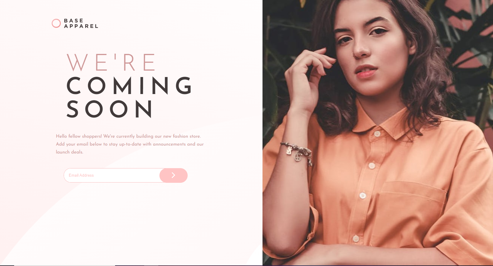

# Frontend Mentor - Base Apparel coming soon page solution

This is a solution to the [Base Apparel coming soon page challenge on Frontend Mentor](https://www.frontendmentor.io/challenges/base-apparel-coming-soon-page-5d46b47f8db8a7063f9331a0). Frontend Mentor challenges help you improve your coding skills by building realistic projects.

## Table of contents

-   [Overview](#overview)
    -   [The challenge](#the-challenge)
    -   [Screenshot](#screenshot)
    -   [Links](#links)
    -   [Built with](#built-with)
    -   [What I learned](#what-i-learned)
-   [Author](#author)
-   [Acknowledgments](#acknowledgments)

## Overview

This project was build based on a challenge from frontend mentor with the purpose of learning more about frontend

### The challenge

Users should be able to:

-   View the optimal layout for the site depending on their device's screen size
-   See hover states for all interactive elements on the page
-   Receive an error message when the `form` is submitted if:
    -   The `input` field is empty
    -   The email address is not formatted correctly

### Screenshot



### Links

-   Solution URL: [Add solution URL here](https://your-solution-url.com)
-   Live Site URL: [Add live site URL here](https://your-live-site-url.com)

### Built with

-   CSS custom properties
-   Flexbox
-   CSS Grid
-   Mobile-first workflow

### What I learned

Learned a little more about Js and regex.

```js
const regex =
    /^[a-zA-Z0-9.!#$%&'*+/=?^_`{|}~-]+@[a-zA-Z0-9](?:[a-zA-Z0-9-]{0,61}[a-zA-Z0-9])?(?:\.[a-zA-Z0-9](?:[a-zA-Z0-9-]{0,61}[a-zA-Z0-9])?)*$/;
document.querySelector(".btn").addEventListener("click", () => {
    if (!regex.test(input.value)) {
        error.classList.add("visible");
        submit.style.borderColor = "red";
        btn.style.boxShadow = "0 7px 2px -2px rgba(0,0,0,0.4)";
        btn.style.filter = "brightness(2.2)";
        warning.style.display = "block";
    } else {
        error.classList.remove("visible");
        submit.style.border = " 1px solid hsl(0, 36%, 70%)";
        btn.style.filter = "brightness(2)";
        warning.style.display = "none";
    }
});
```

## Author

-   Website - [Net](https://www.your-site.com)
-   Frontend Mentor - [@leandromendes25](https://www.frontendmentor.io/profile/leandromendes25)
-   Twitter - [@yourusername](https://www.twitter.com/yourusername)

**Note: Delete this note and add/remove/edit lines above based on what links you'd like to share.**

## Acknowledgments

This is where you can give a hat tip to anyone who helped you out on this project. Perhaps you worked in a team or got some inspiration from someone else's solution. This is the perfect place to give them some credit.

**Note: Delete this note and edit this section's content as necessary. If you completed this challenge by yourself, feel free to delete this section entirely.**
